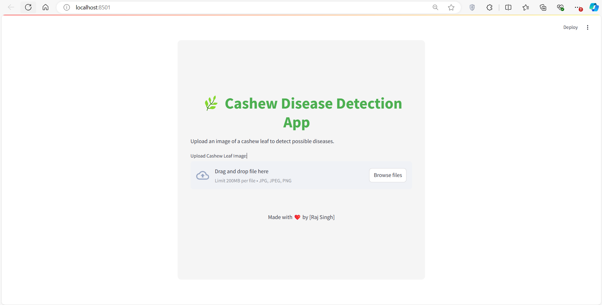
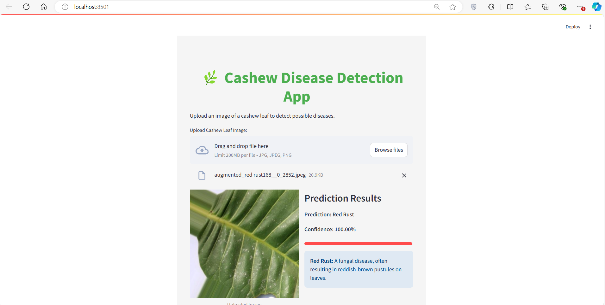
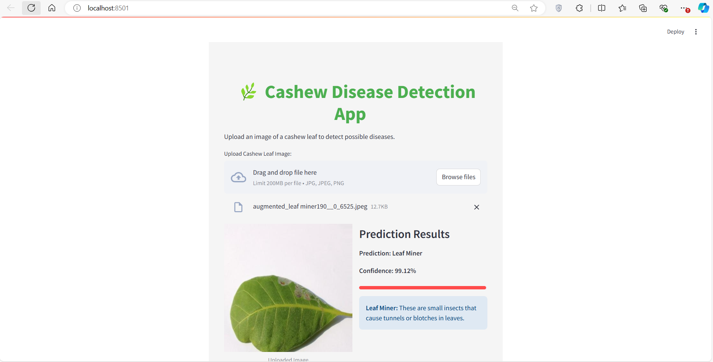

🌿 Cashew Disease Detection App
A tool designed to help farmers and agricultural experts identify and diagnose cashew leaf diseases quickly and efficiently using image classification. This app is built using MobileNet and deployed with Streamlit, making it easy to use for disease detection in the field.

🚀 Key Features

📸 Upload Images: Upload cashew leaf images for real-time disease detection.

🔍 AI Prediction: Detects if the leaf is affected by Anthracnose, Leaf Miner, Red Rust, or is Healthy.

📊 Confidence Score: Displays the model's confidence level for each prediction.

📘 Disease Information: Provides brief descriptions of each disease for better understanding.

#🌱 Disease Categories

Anthracnose: A fungal disease causing leaf spots and lesions.

Leaf Miner: Insect larvae that burrow into leaves, causing tunnels or blotches.

Red Rust: A fungal disease characterized by reddish-brown pustules on leaves.

Healthy: Indicates no visible signs of disease.

#📷 App Interface
   
   
1. Healthy Prediction
Prediction: Healthy
Confidence: 99.82%
Description: No visible diseases detected.

3. Red Rust Prediction
   
Prediction: Red Rust
Confidence: 100.00%
Description: A fungal disease resulting in reddish-brown pustules on leaves.

5. Leaf Miner Prediction
   
Prediction: Leaf Miner
Confidence: 99.12%
Description: Small insect larvae causing visible tunnels or blotches in leaves.

#🧠 Model Overview

The app uses a MobileNet architecture, a lightweight and efficient neural network designed for image classification tasks. The model was trained on a dataset of cashew leaves, categorized into:

Anthracnose
Leaf Miner
Red Rust
Healthy
The model achieves high accuracy in detecting these categories.

#⚙️ How to Run the App
Clone the repository:

bash
```
git clone https://github.com/your-username/cashew-disease-detection.git
```

Run the Streamlit app:

bash
```
streamlit run app.py
```
Upload a cashew leaf image to see real-time disease detection.

#🛠️ Technologies Used

TensorFlow for building and training the deep learning model.

Streamlit for creating an interactive web interface.

Pillow (PIL) for image processing.

#🌟 Future Improvements

📈 Expand the Dataset: Increase the variety and volume of images to improve prediction accuracy.

🌍 Add More Diseases: Extend the model to detect additional cashew leaf diseases.

📱 Mobile Version: Develop a mobile app for easy on-field usage by farmers.

#🤝 Contributing

Contributions are welcome! If you'd like to contribute:

Submit issues for bugs or new features.
Open a pull request with your improvements.

💻 License

This project is open source and available under the MIT License.

